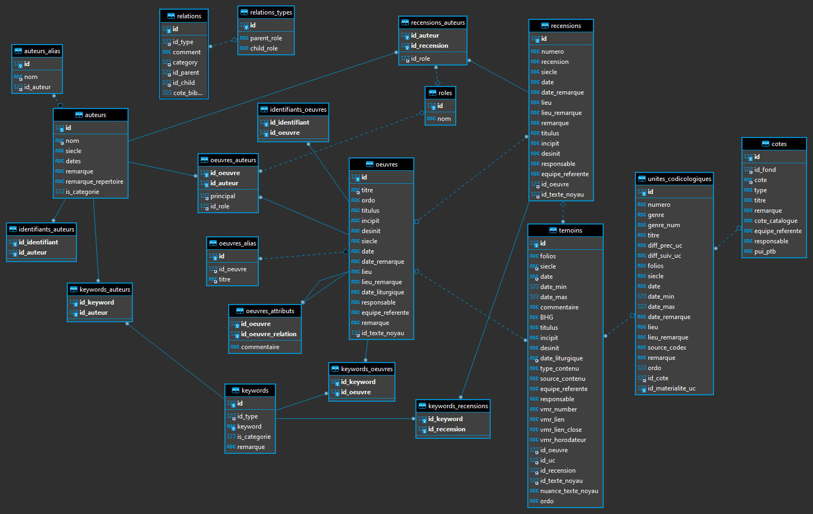

# Pinakes API

An API wrapping an essential search engine for the RAP subset of the Pinakes database.

## Docker

Quick Docker image build:

```bash
docker build . -t vedph2020/pinakes-api:1.0.0 -t vedph2020/pinakes-api:latest
```

(replace with the current version).

To use the image:

1. ensure you have a Pinakes RAP MySql database dump in a zip file (`dump.zip`). This dump is got from Pinakes, and then processed by the tool included in this project to provide indexes. Place the `dump.zip` file under `/opt/pinakes` in your host machine. This folder will be shared through a volume. You can change the folder via environment variables or by directly setting them in the script. See the `docker-compose.yml` script for more.

2. to access Zotero for bibliography you need to set a read-only private key for Zotero's group `ihrt_grec`. This is specified by the environment variable named `ZOTEROKEY`. As explained above, you can set it in the script or just set it as an environment variable in your host machine.

3. run the `docker-compose.yml` script (`docker-compose up` in the script's folder).

This allows updating the data independently from the API image. Whenever the API starts and does not found the `pinakes` database, it will look for the dump in the specified folder, and use it to populate a newly created database.

## Quick Start

Steps to prepare the Pinakes database for these API:

1. have your Pinakes DB imported in MySql under a database named `pinakes`. Should you want to use MySql in a Docker container, do something like:

```ps1
docker run --name mysql -d -e MYSQL_ROOT_PASSWORD=mysql -v c:/data/mysql:/var/lib/mysql -p 3306:3306 mysql --default-authentication-plugin=mysql_native_password
```

assuming that you have created a folder `c:\data\mysql`.

2. build the dates index using the Pinakes RAP CLI (`pinix` in this solution):

```ps1
./pinix index-date pinakes
```

Note that this truncates the target `date` table if present; else it creates it. Also, have a check at the log file created by this process, which might notify you about errors in the source data (or eventually in the parsing algorithm).

3. build the Zotero index using the Pinakes RAP CLI:

```ps1
./pinix index-zotero pinakes
```

Note that this truncates the target `zotero` table if present; else it creates it.

4. build the text-based index using the [Embix CLI](https://github.com/vedph/embix#embix-cli). Here I assume that my profile file is named `pinakes-profile.json` and located in my desktop. You can find the profile in this solution under `Pinakes.Index/Assets`.

```ps1
./embix build-index c:\users\dfusi\desktop\pinakes-profile.json pinakes -t mysql -c
```

Note that this truncates the target `token` and `occurrence` tables if present; else it creates them. Also, the profile draws data also from the `zotero` table created in the previous step.

Also, currently I'm not excluding any stopword from the index. A useful query to inspect the results for the most frequent tokens is:

```sql
SELECT value,
(SELECT COUNT(*) FROM occurrence WHERE occurrence.tokenId=token.id) AS oc FROM token
ORDER BY oc DESC,value;
```

5. start the API project in this solution, and experiment with queries pointing your browser to <http://localhost:59658/swagger/index.html>.

## API Quick Reference

Here I'm just listing the endpoints. Run the API and point your browser to its Swagger UI to get the details.

All the endpoints use the `GET` verb except for the search proper, which requires a `POST` to send all its parameters.

Authors:

- `POST /api/authors`: gets the specified page of authors.
- `GET /api/authors/{id}`: gets the details about the author with the specified ID.

Works:

- `POST api/works`: gets the specified page of works.
- `GET api/works/{id}`: gets the details about the work with the specified ID.

Bibliography:

- `GET ​/api​/biblio-items​/{id}`: gets the bibliography item with the specified ID.
- `GET api/biblio-items-set`: gets the set of bibliographic items having the specified IDs.

Keywords:

- `GET api/keywords/authors`: gets all the keywords related to authors.
- `GET api/keywords/works`: gets all the keywords related to works.

Relations:

- `GET api/relations/parent`: gets all the relations on the parent's edge.
- `GET api/relations/child`: gets all the relations on the child's edge.

## Pinakes Database

This section empirically describes a subset of the Pinakes DB, as illustrated by this schema:



### Keyword

A keyword attached to any entity (`keywords`). They may have a type (`keywords_types`).

For our purposes, we have keywords attached to authors, works, and recensions.

### Work

- `oeuvres`: essentially title and date.
- `oeuvres_alias`: alternative titles for this work.
- `oeuvres_auteurs`: the authors of this work (from `auteurs`). Each connection to an author specifies his role (from `roles`). There is also a `principal` numeric value.
- `identifiants_oeuvres`: the IDs attached to this work (from `identifiants`).
- `keywords_oeuvres`: the keywords attached to this work (from `keywords`).

A work can have a number of related works via:

- `oeuvres_attributs`: a direct connection to another work, eventually with a free text comment.
- `relations`: supposedly, these connect two _works_ (even though there is no explicit formalism in the schema, as no foreign key is explicitly set as a constraint in this table). They seem to be a later addition covering a more structured type of relation, where besides a comment we also have a specific relation type, derived from a dedicated table (`relations_types`). This is more fit to a LOD-like scenario, as it's easy to look at these relations between a parent and a child as triples, where two entities are connected via a predicate, which in turn is another entity. All these relations are mutual, so that for each relation there is a parent and a child role specified (e.g. has-part vs. is-part-of).

### Author

- `auteurs`: essentially name and century and date (both are strings with various expressions). A flag tells if the author is rather a category of works (e.g. aenigmata).
- `auteurs_alias`: alternative names for this author.
- `identifiants_auteurs`: the IDs attached to this author (from `identifiants`).
- `keywords_auteurs`: the keywords attached to this author (from `keywords`).

### Recensions

- `recensions`: essentially recension, title, a number, century and date, and a place.
- `identifiants_recensions`: the IDs attached to this recensio (from `identifiants`).
- `keywords_recensions`: the keywords attached to this recensio (from `keywords`).
- `recensions_auteurs`: the authors of this work (from `auteurs`). Each connection to an author specifies his role (from `roles`).

### Manuscripts

As for the relationship with works, here the atom is represented by the codicological unit. This belongs to some manuscript.

Every unit has 0 or more witnesses, which are the sources for works, or recensions. Recensions are used only when a work can be considered to have several states of its text which are considerably different. In most cases, there is just a single work with no recension, and this work is directly connected to the witnesses. When instead we have several recensions, then the witnesses are parted among them: recension A has witnesses X and Y, recension B has witness Z, etc.

- `temoins`: works (or recensions) have 0 or more witnesses (`temoins`). A witness essentially has sheets range, century, date (more granular, with min and max), a title, incipit/desinit, and corresponds to a codicological unit.

- `unites_codicologiques`: each witness corresponds to a codicological unit via its `id_uc` field, which is the FK for codicological units, `unites_codicologiques`.`id`. A codicological unit too has title, sheet range, century and date with min and max, genre, place, and a parent manuscript.

- `cotes`: each codicological unit belongs to a manuscript via its `id_cote`, which is the FK for `cotes`.`id`. A manuscript essentially has title and type, belongs to a fund, and is connected to physical description via `pui_ptb`.

## Search

Note: the sample SQL has the only purpose of letting reader visualize some data. Real queries will be composed via CTEs or subqueries.

All the searches on text fields (those marked with `[T]` below) are subject to this processing:

1. the text is filtered to remove noise (e.g. typically whitespaces are normalized, only letters, digits, apostrophes are preserved, diacritics are removed, letters are lowercased).
2. the filtered text is tokenized, i.e. split into "words".
3. the tokens (words) are further filtered (e.g. to remove stopwords, generate transliterated forms, etc.).
4. tokens are stored in an index, each with all its occurrences.

This way you can look for any word or part of a word in any of the indexed fields. This words-index can then be searched in combination with other metadata like dates, types, etc. as specified below in the filters for each search target.

### Text Pipeline

The details for text filtering and tokenization pipeline are as follows:

As a general principle for indexing text fields:

- tags are removed (we may have any HTML/XML tags inside text fields).
- a `/` is treated like a whitespace. This is useful in those cases where e.g. several variants of a name are entered in a field with a separator like slash, e.g. `Rome/Roma`. In this case, the `/` must be treated as a token separator; otherwise, it would just be ignored and `RomeRoma` would be the resulting "word").
- whitespaces are normalized.
- diacritics are removed.
- case differences are flattened.
- tokenization uses whitespaces only as separator. This is usually enough for DB text fields, unless you have special requirements: e.g. in English texts we treat `'` as a separator to split forms like `it's` into `it` and `s`, but I don't know about the details of the languages used, and anyway forms like `it` or `s` would be usually discarded as stopwords.
- probably, a list of stopwords (e.g. "the", "a", "of"...) can be provided to avoid indexing words which can be treated as irrelevant (rumor) in DB searches for those text fields having a relatively long text, rather than just holding a name. Here of course the list depends on the languages used. For instance, we would typically remove Greek articles from the index. A first indexing anyway will be completed without stopwords, so that we can see which words are present and if stopwords should be removed or not.
- Greek words are automatically transliterated, according to the Pinakes convention. This does not mean that Greek is not indexed, but only that for each Greek word, a corresponding transliterated word is added to the index, side to side to the Greek form. The Greek form of course is still subject to all the transformations illustrated above.

### Other Metadata

Date metadata (for centuries) need to be preprocessed for indexing: in `auteurs.siecle`, `oeuvres.siecle`, the century is a string like:

- `09`
- `11 (2/2)`
- `09-10`
- `13 ex. - 14 in.`
- `14 ex - 15` (the `.` may be missing)
- `15 (2/2) - 16 (1/4)`
- `1657-1719` by error; this is not considered valid, as it should be sporadic.

These dates are parsed and inserted into a `date` table which gets filled with the original date expression (`source`), its normalized text value and the corresponding approximate numeric value, and the ID of the source author or work having that date (`field` is used to specify a code representing the source table: `aut` or `wrk`). For instance:

```txt
field targetid datetxt       dateval source
wrk   86       XV AD         1450    15
wrk   89       XIV AD        1350    14
wrk   355      XI -- XII AD  1100    11-12
wrk   358      c. 1125 AD    1125    12 (1/2)
...
```

Invalid dates are listed in the log, like this (referring to an author, Hierotheus (Iohannes) Comnenus Drystrae metr., where the date has been mistakenly inserted in the century field):

```txt
2021-06-30 07:38:31.047 +02:00 [ERR] Invalid date at aut#3119: "1657-1719"
```

### Subset

This is not exposed in a UI, but is a general filter always applied to get only the RAP data subset.

RAP records are identified in table `identifiants` by `id_type`=234 (e.g. `SELECT * FROM pinakes.identifiants where remarque like '%bucossi%';`). In `remarque` you find the name of the curator (e.g. `Curator: Bucossi 2020`).

So, these should be the RAP works:

```sql
SELECT w.id, w.titre, i.id_type FROM oeuvres w
INNER JOIN identifiants_oeuvres wi ON w.id=wi.id_oeuvre
INNER JOIN identifiants i ON wi.id_identifiant=i.id
WHERE i.id_type=234
ORDER BY w.titre;
```

And these might possibly be the RAP authors:

```sql
SELECT a.id, a.nom, i.id_type FROM auteurs a
INNER JOIN identifiants_auteurs ai ON a.id=ai.id_auteur
INNER JOIN identifiants i ON ai.id_identifiant=i.id
WHERE i.id_type=234
ORDER BY a.nom;
```

Yet, for authors I get no results. Perhaps this depends on the fact that authors cross the boundaries of a single project, so that maybe the author X has been entered in the context of project Y, and then has just been reused in the context of project Z. If this is true, we cannot filter authors in the same way, but we should rather rely on their works, like:

```sql
SELECT a.id, a.nom, i.id_type FROM auteurs a
INNER JOIN oeuvres_auteurs wa ON a.id=wa.id_auteur
INNER JOIN identifiants_oeuvres wi ON wi.id_oeuvre=wa.id_oeuvre
INNER JOIN identifiants i ON wi.id_identifiant=i.id
WHERE i.id_type=234
ORDER BY a.nom;
```

This returns some results. Of course, this has the disadvantage that we would never find an author without any work, which anyway does not appear to be the case, at least for RAP.

### Search Author

Filters:

- name (any portion): `auteurs.nom`[T].
- aliases (as above): `auteurs_alias.nom`[T].
- category (yes/no): `auteurs.is_categorie`=0 or 1; the filter can be true for a category author, false for a non-category author, null if not specified.
- centuryMin, centuryMax: dates in `auteurs.siecle` are indexed into `date` with `field`=`aut`.
- keywords (0 or more): `keywords.keyword`[T] via `keywords_auteurs`.

```sql
select
auteurs.id, auteurs.nom, auteurs.siecle, auteurs.dates, auteurs.remarque, auteurs.is_categorie,
aa.nom as alias,
k.keyword as keyword
from auteurs
left join auteurs_alias aa on auteurs.id=aa.id_auteur
left join keywords_auteurs ka ON auteurs.id=ka.id_auteur
left join keywords k ON k.id=ka.id_keyword
limit 10
```

From the resulting list of authors, one can open the full list of works for each author.

### Search Work

Filters:

- title (any portion): `oeuvres.titre`[T].
- aliases (as above): `oeuvres_alias.titre`[T].
- titulus (as above): `oeuvres.titulus`[T].
- incipit (as above): `oeuvres.incipit`[T].
- desinit (as above): `oeuvres.desinit`[T].
- centuryMin, centuryMax: `oeuvres.siecle`: dates in `oeuvres.siecle` are indexed into `date` with `field`=`wrk`.
- place (as above): `oeuvres.lieu`[T].
- remark: `oeuvres.remarque`[T].
- dictyon number: this is equal to `cote.id`, and we get to it via `temoins` (`id_oeuvre`) to `unites_codicologiques` (on `id_materialite_uc`) and its FK `id_cote`.
- keyword (0 or more): `keywords.keyword`[T] via `keywords_oeuvres`.
- having relation (1 optional relation to pick from the list, or just any to match any type of relation). This can be connected with the next filter. Relation is via table `relations`; types of relations are picked from `relations_types`.
- with work (1 work to pick from a list, or nothing to match any relation target). Field: `relations.id_child`.

The relation filter could then be used to find all the works having some kind of relation to any other work, or to just a specific work; or having some relation to a specific work, either a specific relation or any.

It's not clear how this is connected with the work attributes and their direct, "weak" relation to another work (`oeuvres_attributs`). I could just include this kind of relation in the general filter proposed above, which would thus be able to find both the "weak" and the "strong" relations. If instead this is not used, we can just ignore it.

```sql
select
oeuvres.id, oeuvres.titre, oeuvres.titulus, oeuvres.incipit, oeuvres.desinit, oeuvres.siecle,
oeuvres.date, oeuvres.date_remarque, oeuvres.lieu, oeuvres.lieu_remarque, oeuvres.remarque,
oeuvres.equipe_referente,
oa.titre as alias,
k.keyword as keyword
from oeuvres
left join oeuvres_alias oa on oeuvres.id=oa.id_oeuvre
left join keywords_oeuvres ko ON oeuvres.id=ko.id_oeuvre
left join keywords k ON k.id=ko.id_keyword
where oeuvres.equipe_referente='rap'
limit 10
```

### Bibliography

- group: `irht_grec` (ID 669969).
- [API docs](https://www.zotero.org/support/dev/web_api/v3/basics)

A sample Zotero URI has a group ID and a collection ID, e.g. <https://www.zotero.org/groups/44775/manuscripts_on_microfilm_project/library>. The ID of a Zotero item is just the library ID + the item ID, e.g. `669969-548S2DQW` <https://www.zotero.org/groups/669969/irht_grec/items/548S2DQW/library>.

Base URI: <https://api.zotero.org>.

You must request a specific version of the API via HTTP header `Zotero-API-Version: 3`. Authentication is required for access to non public libraries.  End users can create API keys via their Zotero account settings. Use header `Authorization: Bearer TOKEN...`.

So each request has header with:

- Zotero-API-Version: 3
- Authorization: Bearer APIKEY

For instance:

1. getting user ID: <https://api.zotero.org/users/8216379/groups>. This is done just once.

2. getting items: <https://api.zotero.org/groups/669969/items>.

The items query returns an array where each object has among other properties:

- `data.key` (e.g. `HUAJ26D4`): this is the item ID which is supposedly unique only whithin its library. So the complete ID for a Zotero item can be built by prefixing the library ID to this (e.g. `669969-HUAJ26D4`).
- `data.itemType` (e.g. `book`)
- `data.creators`: array with objects having:
  - `creatorType` (e.g. `author`)
  - `firstName`
  - `lastName`
- `data.title`
- `data.abstractNote`
- `data.series`
- `data.seriesNumber`
- `data.edition`
- `data.place`
- `data.publisher`
- `data.date` (e.g. `2011`)
- `data.language` (e.g. `allemand`)
- `data.ISBN`

3. getting item: https://api.zotero.org/groups/669969/items/HUAJ26D4

Returns a single object with the same schema of objects in the items list.

As for bibliography, we include in the search only a subset of Zotero's data for each item. This implies that the indexer must get the required bibliographic data from Zotero, and build a local index; otherwise performance would suffer, as we would have to fire two different searches, where one of them is on external server reached via web, and combine the results. Also, the Zotero server is not designed to handle a lot of search requests, as of course its resources are limited.

In Pinakes, the connection between works/authors and their bibliography is found in `mobigen_oeuvres` and `mobigen_auteurs`. So for a work/author I should find it by its ID in the `mobigen_oeuvres` and `mobigen_auteurs`, thus getting the `id_mobigen` out of them.

To get only the bibliography we are interested in for RAP, we get all the RAP authors/works IDs, and for each of them we get its corresponding bibliographic records if any. For instance, this query shows you the bibliographic items connected to RAP authors:

```sql
SELECT a.id, a.nom, m.cle_zotero FROM auteurs a
INNER JOIN oeuvres_auteurs wa ON a.id=wa.id_auteur
INNER JOIN identifiants_oeuvres wi ON wi.id_oeuvre=wa.id_oeuvre
INNER JOIN identifiants i ON wi.id_identifiant=i.id
INNER JOIN mobigen_auteurs ma ON a.id=ma.id_auteur
INNER JOIN mobigen m ON ma.id_mobigen=m.id
WHERE i.id_type=234
ORDER BY a.nom
```

And this is the same for works:

```sql
SELECT w.id, w.titre, m.cle_zotero FROM oeuvres w
INNER JOIN identifiants_oeuvres wi ON w.id=wi.id_oeuvre
INNER JOIN identifiants i ON wi.id_identifiant=i.id
INNER JOIN mobigen_oeuvres mw ON w.id=mw.id_oeuvre
INNER JOIN mobigen m ON mw.id_mobigen=m.id
WHERE i.id_type=234
ORDER BY w.titre;
```

We need to fetch from Zotero only the data used in search, i.e.:

- `data.key` (e.g. `HUAJ26D4`)
- `data.creators`: array with objects having:
  - `creatorType` (e.g. `author`)
  - `firstName`
  - `lastName`
- `data.title`
- `data.abstractNote`

### Embix Profile

The text-based index portion of the search engine uses [Embix](https://github.com/vedph/embix). The Embix profile for Pinakes uses documents for authors, works, author bibliography and work bibliography.

Among the components in the Embix chain, there is a Greek token multiplier, which provides the transliterated form of each Greek token next to it. As the transliterated form is targeted to the index process, it comes already deprived of any rumor feature, like accents or casing; this is done by just using a 7-bit ASCII encoding as the transliteration target.

These are the Pinakes conventions:

- `β` = `b`
- `ε` = `e`
- `ζ` = `z`
- `η` = `e`
- `θ` = `th`
- `κ` = `k`
- `ξ` = `x`
- `ρ` = `rh`/`r` (`rh` en début de mot ou lorsqu’il a deux ρ, sinon simplement `r`)
- `υ` = `y`
- `φ` = `ph`
- `χ` = `ch`
- `ω` = `o`
- `γγ` = `gg`
- `ευ` = `eu`
- `μπ` = `mp`
- `ου` = `ou`
- esprit rude = `h`

## Consuming API

Here I list a set of sample services provided by a UI consuming this API.

1. list authors (`/api/authors`): get a paged list of authors, variously filtered. Filters include zero or more keywords, picked from a list. Filters:

- page number
- page size
- text
- match any / match all in text
- text scope (1 or more from `aunam`=author name, `aanam`=alias, `aunot`=note; plus, from Zotero: `zattl`, `zaaut`, `zaabs`)
- is category
- min century
- max century
- keyword ID(s) (from a list)

2. show details for a specific author (`/api/authors/ID`): data about the author and his works and bibliography. Bibliography comes from Zotero API.

3. list works (`/api/works`): get a paged list of works, variously filtered. Filters include zero or 1 author, picked from a list; and zero or more keywords, picked from a list. Filters:

- page number
- page size
- text
- match any / match all in text
- text scope (1 or more from `wkttl`=work title, `wattl`=title alias, `wkinc`=incipit, `wkdes`=desinit, `wkplc`=place, `wknot`=note; plus, from Zotero: `zwttl`, `zwaut`, `zwabs`)
- author ID (from a list)
- dictyon ID
- min century
- max century
- keyword ID(s) (from a list)
- relation ID(s) (from a list)

4. show details for a specific work (`/api/works/ID`): data about the work and its bibliography. Bibliography comes from Zotero API.

5. get the full list of authors keywords (`/api/keywords/authors`). This is useful to provide a keywords list in author's filters.

6. get the full list of works keywords (`/api/keywords/works`). This is useful to provide a keywords list in work's filters.

7. lookup authors (`api/authors`): to lookup authors (get a list of matches while typing some letters) just use the authors search endpoint with page number=1, page size=the limit of matches to get, and text=the text typed.

8. lookup works (`api/works`): to lookup works (get a list of matches while typing some letters) just use the works search endpoint with page number=1, page size=the limit of matches to get, and text=the text typed.

9. lookup relations (`api/relations`): to get the list of relations from the point of view of its parent edge we just select `parent_role` from `relations_types`.

## Details

Details for an author:

```sql
SELECT a.id,a.nom,a.siecle,a.dates,a.remarque,a.is_categorie,aa.nom,k.keyword 
FROM auteurs a
LEFT JOIN auteurs_alias aa ON a.id=aa.id_auteur
LEFT JOIN keywords_auteurs ak ON a.id=ak.id_auteur 
LEFT JOIN keywords k ON ak.id_keyword=k.id
WHERE a.id=@id
```

Details for a work:

```sql
SELECT w.id,w.titre,w.titulus,w.incipit,w.desinit,w.siecle,w.date,
w.date_remarque,w.lieu,w.lieu_remarque,w.responsable,w.equipe_referente,w.remarque
FROM oeuvres w
LEFT JOIN oeuvres_alias wa ON w.id=wa.id_oeuvre 
LEFT JOIN keywords_oeuvres wk ON w.id=wk.id_oeuvre
LEFT JOIN keywords k ON wk.id_keyword=k.id
WHERE w.id=@id
```
